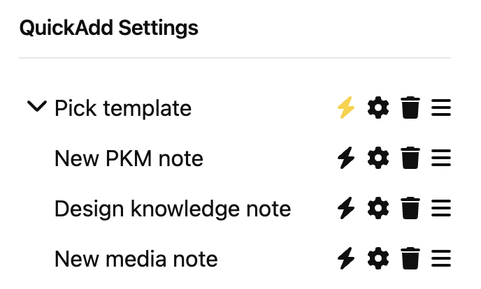
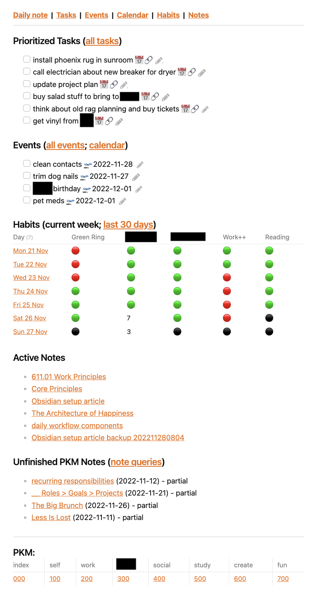

### Obsidian Vault Setup for a Non-Student/Non-Youtuber
(knowledge worker/project manager/entrepreneur/creative/student of life)

---

# Introduction
My Obsidian vault setup is geared toward bullet journaling and life management, with a secondary focus on PKM. So it's not heavily focused on studying and knowledge retention, which many of the vault setups I've read and watched seem to focus on. That is great for students but I wanted to show a setup more geared toward knowledge workers and project/product managers.

# Outline
[Setup](#Setup)
- [1. Personal knowledge management (PKM)](#1-personal-knowledge-management-PKM)
- [2. Daily notes](#2-daily-notes)
- [3. Tasks and projects](#3-tasks-and-projects)
- [4. Events](#4-events)
- [5. Habits](#5-habits)
- [6. Dashboard](#6-dashboard)
- [7. General thoughts](#7-general-thoughts)

[Conclusion](#Conclusion)

# Setup

## 1. Personal knowledge management (PKM)
I spent the most time in my vault "beta-testing" trying to figure out how I wanted my hundreds and eventually thousands of notes to be structured or linked. After deciphering all of these new acronyms (PKM, PARA, OKR, etc.), I discovered the [Johnny Decimal](https://johnnydecimal.com/) system. I inevitably modified the system to suit my needs and ended up with more of an old school Dewey decimal library cataloguing system (totally on accident and not just because I am old).

### Topic hierarchy
My PKM hierarchy is a combination of personal roles and information repositories:

- 000 Index
- 100 Self
- 200 Work
- 300 Side hustle
- 400 Social
- 500 Study
- 600 Creativity
- 700 Enrichment

Every "hundred" is a major topic. Every "ten" is a category. Every "one" is a sub-category. Lastly, every decimal is the lowest categorization (regardless of any logical levels that may exist above or below it). Below is a breakdown of an example that goes to the lowest category:

- 400 Social
	- 410 Family
	- 420 Community
	- 430 Groups
		- 431 Discord servers
		- 432 Blades in the Dark
			- 432.01 The Dirty Discards

**NOTE:** My numbering system does not go down to the document level as JD does, only to the lowest category.

### PKM templates
Now that my hierarchy is established, notes that belong in the knowledge archive should be tagged. I have a PKM note template for this, plus an abbreviated template that I can drop into a note if it wasn't created with the template but still needs PKM metadata.

Here is the full PKM note template:

```
Created:: `= this.file.cday`
PrimaryTopic:: 
SecondaryTopics:: 
PKMStatus:: new
`(new | partial | active | complete | improved | shelved)`

---

## Capture:


## Insight:


## Linked Thoughts:

```

A couple of things to note:
- The Created field uses an inline [Dataview](https://github.com/blacksmithgu/obsidian-dataview) query that will always display the date that the note was created.
- The Status field defaults to "new" and also lists valid field values below it, to facilitate reporting.
- The metadata-only template is just the first five lines of the full template.

### Breadcrumbs plugin
Once my topic hierarchy was established, I used the [Breadcrumbs plugin](https://github.com/SkepticMystic/breadcrumbs) to set metadata on every topic and render it in a table of contents on my 000 Index note. This was an admittedly tedious process and there was probably a more automated and efficient way to generate the index, but it's done now unless I blow up my hierarchy and start over. 

### Quickadd template picker for new notes
I have additional PKM templates that I use for media and design notes. They all contain the PKM metadata.

To easily create a new note with one of these three templates, I created the following workflow using the [Quickadd plugin](https://github.com/chhoumann/quickadd) :

1. Create a "template picker" MULTI item and set a hotkey to it.
2. Create as many TEMPLATE items as you need and move them into the MULTI item so that the TEMPLATE items are nested and ordered inside the MULTI item.
3. Note: Using this method means that you do not have to set hotkeys on the nested commands.



*([^ top](#Introduction))*

## 2. Daily notes
Daily notes are the backbone of my productivity system and therefore get a lot of focus in my vault. All of my tasks are generated out of work and personal meetings. The tasks are then consolidated via queries for tracking, editing and re-prioritization (more explanation in the tasks section). Below are the sections that comprise my daily notes template.

### Date header
I don't actually remember why the header became this complicated, but I can tell you that it employs the [Templater plugin](https://github.com/SilentVoid13/Templater) for all of the fiddly coding-y bits.

```
[[Daily Notes/<% tp.date.now("YYYY-MM-DD", -1, tp.file.title, "YYYY-MM-DD") %>|<% tp.date.now("YYYY-MM-DD", -1, tp.file.title, "YYYY-MM-DD") %>]] < <% tp.file.creation_date("ddd D MMM YYYY") %> > [[Daily Notes/<% tp.date.now("YYYY-MM-DD", +1, tp.file.title, "YYYY-MM-DD") %>|<% tp.date.now("YYYY-MM-DD", +1, tp.file.title, "YYYY-MM-DD") %>]]
```

Translation of the above: "Take yesterday's date (in the format of 2021-12-31 or YYYY-MM-DD) and derive a link to yesterday's daily note in the Daily Notes folder...but then make the link text show yesterday's date *without* showing the folder name. Do the exact same thing again but for tomorrow's date instead of yesterday (in this made-up example it would be 2022-01-02). However...! In between yesterday and tomorrow, put today's date but in the format of Mon 1 Jan 2022."

Output (after rendering and replacing the Templater code):
```
[[Daily Notes/2021-12-31|2021-12-31]] < Mon 1 Jan 2022 > [[Daily Notes/2022-01-02|2022-01-02]]
```

Which in reading mode will look like this:
[[Daily Notes/2021-12-31|2021-12-31]] < Mon 1 Jan 2022 > [[Daily Notes/2022-01-02|2022-01-02]]

### Meetings
I create a header for every meeting (so that I can link to it from other notes when needed). I also have a Quickadd command hotkey to create the header and insert the meeting title. Notes and tasks go under the meeting header.

### Ad Hoc Notes
Random information and tasks not generated during a meeting go here. (This happens a lot to me.) I also have a Quickadd command hotkey that adds a task at the end of the ad hoc notes section. Dead useful.

### Inventory
A place to put thoughts about how my day went, significant events,struggles, etc.

### Habits
These are listed as data fields (Field:: Value) at the bottom of the template. Habit stats will be rendered in a table on the dashboard and in a separate note.

*([^ top](#Introduction))*

## 3. Tasks and projects

### Tasks for tasks
I use the [Tasks plugin](https://github.com/obsidian-tasks-group/obsidian-tasks) for a couple of different things. The first tasks view is for all tasks with priority and/or a due date:

```
(backticks)tasks
not done
(has due date) OR (priority is above none)
hide backlinks
hide task count
(backticks)
```

I have also created a separate note containing Tasks queries for the following lists:
- Unprioritized tasks
- "Someday" tasks
- All open tasks (as a check against other views)

### Roles/Aspirations/Goals/Projects
Rather than wax on unnecessarily about the philosophy of productivity, I will briefly describe how I categorize my approach:
- Role - A discrete identity that I have identified, such as student, worker, physical being, etc.
- Aspiration - A peak ideal for each role, i.e. successful business owner, regularly competing triathlete, etc.
- Goal - One of several stepping stones on the path to reach your aspiration. An aspiration without a goal is just a dream.
- Project - A list of discrete milestones and tasks that partially or fully complete a stated goal. A goal may required several projects for completion; the key is to keep projects and tasks in manageable-sized chunks.

*([^ top](#Introduction))*

## 4. Events
I am using Obsidian to capture and track recurring and non-recurring events, as well as tasks tied to a hard date (NOT a due date). While there are a few plugins that have calendar functionality, they felt very bolted on and not part of the regular process of information capture and querying that exists in the rest of the application. My events setup consists of the following elements:

- Event capture - an events note that contains recurring events, all of which have start dates.
- Events tasks query - a calendar note that contains views showing tasks that contain a start date (see explanation about the calendar script below).
- Daily notes event capture - In my bullet journal, if I need to capture an event then I create a task and add a start date to it. (The Tasks plugin uses default scheduled dates for tasks without any dates on them, so I don't want to use scheduled dates for my calendar queries.)
- Ad hoc event capture - a Quickadd command hotkey that captures the event name and start date and places it at the end of the events note.

### Calendar/script
The only script I use in my vault is for a monthly and weekly calendar ([found here](https://github.com/702573N/Obsidian-Tasks-Calendar)). The calendar query only shows tasks that I have designated as events using the Start Date field from the Tasks plugin:

```
(backticks)dataviewjs
await dv.view("zzzScripts", {pages: "dv.pages().file.tasks.where(t => t.start)", view: "week", firstDayOfWeek: 1, options: "style1 noDone"})
(backticks)
```

Translation: "Pull this script from the zzzScripts folder and use it to show me a weekly calendar for any task that has a start date. Display the week starting on Monday using style 1 and excluding completed tasks (events)."

*([^ top](#Introduction))*

## 5. Habits
### Dataview query for habits
Habit tracking consists of a handful of data fields in my daily note template and then two Dataview queries: one on my dashboard and one on its own page.

Here is a snippet of the dashboard Dataview query that should provide sufficient context for duplication:

```
(backticks)dataview
TABLE WITHOUT ID
  link(file.link, dateformat(file.cday, "ccc d LLL")) as Day,
  choice(BinaryHabit = "y", "🟢", choice(BinaryHabit = "n", "🔴", "⚫")) as "Binary Habit",
  choice(CountLimitHabit >= 10, "🟢", choice(CountLimitHabit = "n", "🔴", CountLimitHabit)) as "Count Limit Habit",
  choice(NonNullHabit = null, "⚫", choice(NonNullHabit = "n", "🔴", "🟢")) as "Non Null Habit"
FROM "Daily Notes"
WHERE file.day >= date(sow) AND file.day <= date(sow) + dur(7days)
SORT file.day ASC
(backticks)
```

Translation:
- Make a table.
- Show the linked daily note with a custom date format to show the date like "Mon 1 Jan". 
- Show custom column header text since the field names cannot contain spaces.
- For the BinaryHabit field, show a green circle if the field value is "y"; show a red circle if the field value is "n"; show a black circle if the field value is blank.
- For the CountLimitHabit field, show a green circle if the field value is 10 or more; show a red circle if the field value is "n". Show the actual field value if the field value is less than 10 (it does not qualify for any other condition so it just shows the value; there is no condition that will render a black circle).
- For the NonNullHabit field, show a black circle if the field is null; show a red circle if the field ONLY contains "n"; show a green circle for any other non-null value. (This formula is good for habits where you want to list a book you are reading or a short narrative of work performed on that habit.)
- Only query notes in the Daily Notes folder.
- Only show rows for the current week. (The clause for my other page showing the last 30 days is `WHERE file.day <= date(now) AND file.day >= date(now) - dur(30days)`.)
- Sort results by file date in ascending order.

*([^ top](#Introduction))*

## 6. Dashboard
Now that I have established all of the distinct pieces that go into my day-to-day self-management, I need a way to view all of them at a glance. I need a dashboard!

Here's everything I put on it:
- Top link bar (contains "friendly text" links to the current daily note, tasks, events, calendar, habits, and notes)
- Prioritized tasks (Tasks query)
- Upcoming events list for next 7 days (Tasks query)
- Habit tracking for the current week (Dataview query)
- Active notes/unfinished notes (Dataview queries)
- PKM (Table with links to top level PKM categories)

I now have access to ~80% of the content that I might need to get to in my vault and don't even need to open my left or right sidebars! I can't call it minimalist (my nirvana) but I can at least comfortably call it streamlined.

**NOTE:** To get the link to the daily note, I use the following inline Dataview query (that roughly translates to "give me a link to today's date, wrap a link around it, but also put alt text on the link"):
```
`="[[" + dateformat(date(today), "yyyy-MM-dd") + "|Daily note]]"`
```
*(thanks to [mnvwvnm](https://forum.obsidian.md/u/mnvwvnm/summary) who posted the above solution on [this Obsidian forum post](https://forum.obsidian.md/t/dynamic-link-to-daily-note-with-todays-date/25190))*

Below is a screenshot of my dashboard in action:



It is important for me to have a dashboard that is one column and succinct in its layout, with links to deeper content/tracking as opposed to a sprawling command center that my eyes will glaze over and cause me to lose focus.

*([^ top](#Introduction))*

## 7. General thoughts
### Other plugins
I have tried to cover plugins I use in the narrative of the setup above but here are a few more:
- Minimal theme, [Minimal Theme Settings](https://github.com/kepano/obsidian-minimal-settings), and [Style Settings plugin](https://github.com/mgmeyers/obsidian-style-settings) - just for styling.
- [Calendar](https://github.com/liamcain/obsidian-calendar-plugin) - this is just for daily notes and I don't use it much now that I have the date header in my daily note template; but it's there if I need to jump back to a specific date.
- [Natural Language Dates](https://github.com/argenos/nldates-obsidian) - this plugin should be installed if you ever install the Tasks plugin; they just go very well together.
- [Hotkeys for templates](https://github.com/Vinzent03/obsidian-hotkeys-for-templates) - I actually think that I am using this less now that I have figured out how to make the Quickadd plugin do choice pickers; but if you are not planning to go down that route, this plugin is pretty useful to save steps in your workflow.

### Folders
Since I am trying to treat Obsidian as an application as opposed to a notes repository, I have tried to keep it as flat as possible. To date, I have three folders in my vault and none of those folders have subfolders. \**flex*\*

A no-folders strategy puts a heavier reliance on searching, linking and backlinks...but Obsidian is great at that so I haven't noticed any drawbacks so far.

### Frontmatter
A few thoughts on frontmatter:
- Frontmatter has to go at the top of the page; I would prefer to be able to put it at the bottom if needed.
- Frontmatter is, by default, displayed as code and requires a plugin to style it.
- Frontmatter fields cannot contain Dataview inline queries (which I use for creation dates).
- Inline data fields (Field:: Value) work exactly the same and can be placed anywhere in the note, even in separate sections.

### Scripts
I have exactly one script deployed in my vault (for calendar rendering) and if that was a plugin, I would have installed that instead. Simply put, I know my strengths and programming is not one of them. I can, through sheer force of will, bend a chunk of code to my purposes if needed but it always feels like an incredibly inefficient use of my time. There are so many smarter people out there building these open source tools, whom I can donate to in appreciation of their work.

### Graph
I tried a few times to convince myself that the graph was useful; I did not succeed. The nature of my vault and notes are such that I am frequently just plunging forward with my activities and search for anything I need to put my hands (eyes?) on. I will re-visit the graph every few months or so to see if I have accumulated enough data to begin using the graph as a brainstorming and ideation tool.

### Credits
I have tried to link to source material wherever possible, but if you see a tool or configuration piece that you need to claim credit for, please reach out.

In addition, the Obsidian YT community has been a great help in my Obsidian education process. Specific shout-outs to:
- [Nicole van der Hoeven](https://www.youtube.com/@nicolevdh)
- [Danny Hatcher](https://www.youtube.com/@DannyHatcher)
- [Bryan Jenks](https://www.youtube.com/@BryanJenksTech)
- [Justin @EffectiveCo](https://www.youtube.com/@EffectiveCo)
- [Clare Macrae](https://github.com/claremacrae)

*([^ top](#Introduction))*

# Conclusion
While this article is intended to be useful for knowledge workers as opposed to students and youtubers, everybody is welcome to take anything useful from my setup and discard all the bits that are unnecessary or not useful.

I am certain that like most Obsidian users, given the improvements to the app and the ingenuity of the people building plugins for it, my vault setup will continue to shift the more I use it and the more my use cases for the platform evolve.

The limitless configuration options will continue to befuddle initiates to the Obsidian universe but to them I say, as many others have said: start small. Don't be afraid to reconfigure your system a few times (I did) and let it evolve. The only things that will prevent you from fine-tuning Obsidian to suit your needs are those standard extremes of poor productivity: laziness and perfectionism. So dive in and get your hands dirty!

If you have questions for follow-up, please feel free to start a [discussion](https://github.com/bayradberry/celsius233/discussions) in the repository where this article lives.

*([^ top](#Introduction))*
